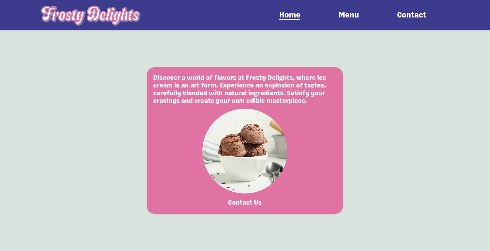
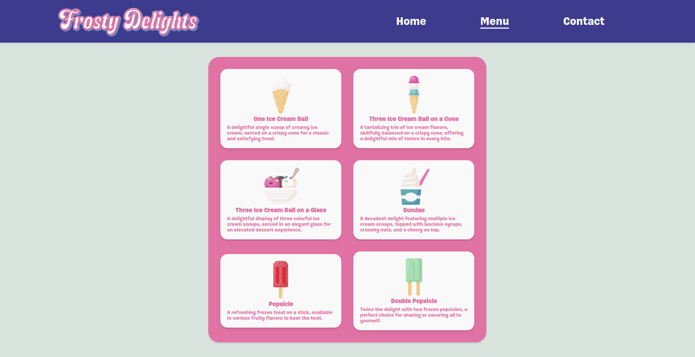
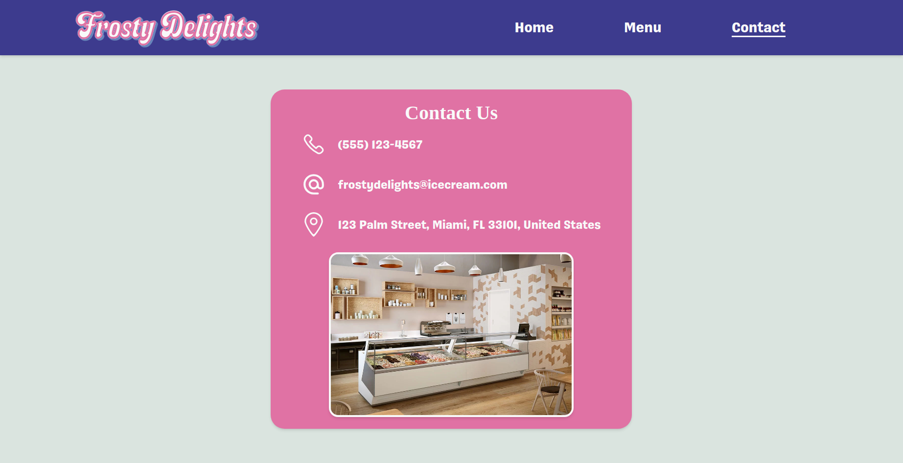

# Restaurant Project





<p align="center">
  <a href="https://joao4xz.github.io/odin_restaurant/">Live Preview</a>
</p>

"The Odin Project" restaurant page project.

This project has the purpose of using modules, webpack, HtmlWebpackPlugin and Sass.

## Installation
To get the project up and running on your local machine, follow these steps:

1. Clone the repository: git clone https://github.com/joao4xz/odin_restaurant.git
2. Navigate to the project directory: cd odin_restaurant
3. Install the dependencies:
   ```shell
   npm install
   ```
## Usage
After installation, you can use the following commands:

Run the development server:
```shell
npm run start
```
This command will start the development server, and you can access the application at http://localhost:8080.
Build the production-ready code:
```shell
npm run build
```
This command will generate the production-ready files in the dist folder.
